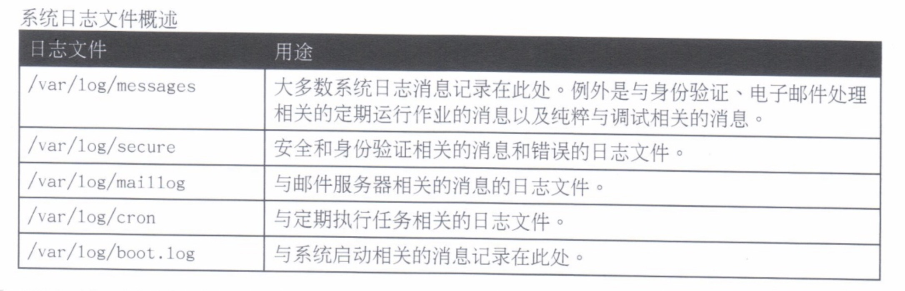
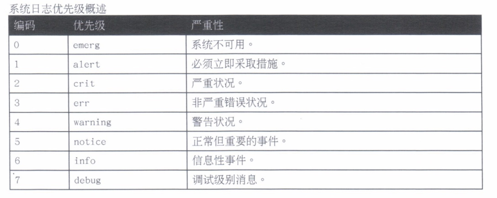
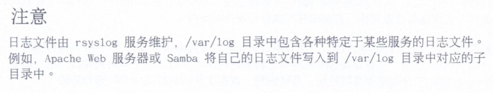
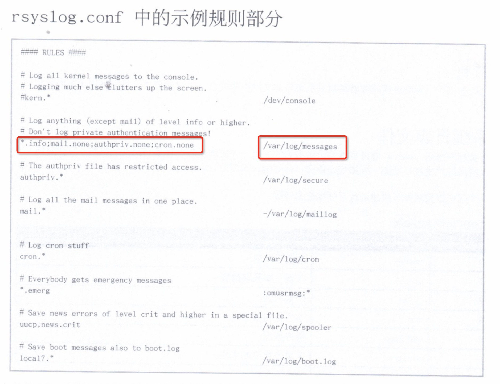
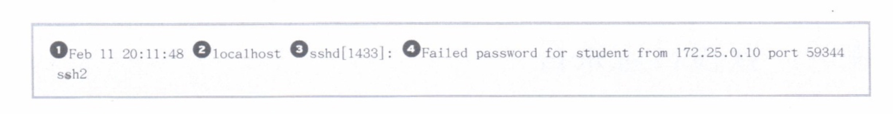

# 10.分析和存储日志

---

## 系统日志架构

* 系统日志

### 系统日志

进程和操作系统内核需要能够为发生的事件记录日志。这些日志可用于系统审核和问题的故障排除。依照惯例，这些日志永久存储在 `/var/log` 目录中。

基于系统日工资协议的标准日志记录系统。RHEL7 中系统子日志消息由两个服务负责处理，它们是 `systemd-journald` 和 `rsyslog`。

`systemd-journald` 守护进程提供一种改进的日志服务，可以收集来自内核、启动过程的早期阶段、标准输出、系统日志，以及守护进程启动和运行期间错误的消息。系统日志消息也可由 `systemd-journald` 转发到 `rsyslog` 以做进一步处理。

`rsyslog` 服务随后根据类型（或设备）和优先级排列系统日志消息，将它们写入到 `/var/log` 目录内的永久文件中。

`/var/log` 目录保管由 `rsyslog` 维护的各种特定于系统和服务的日志文件。



## 查看系统日志文件

* 系统日志文件
* 日志文件轮转
* 分析系统日志条目
* 利用 `tail` 监控日志文件
* 使用 `logger` 发送系统日志消息

### 系统日志文件

许多程序使用 `syslog` 协议将事件记录到系统。每一条日志消息根据设备（**消息的类型**）和优先级（**消息的严重性**）分类。

八个优先级按周如下所述进行了标准化和评级：



`rsyslogd` 服务使用日志消息的设备和优先级来确定如何进行处理。通过 `/etc/rsyslog.conf` 文件，以及 `/etc/rsyslog.d` 中的 `*.conf` 文件进行配置。

`/etc/rsyslog.conf` 的 `#### RULES ####` 部分包含定义日志消息保存位置的相关指令。每行**左侧表示与指令匹配的日志消息的设备和严重性**。每行**右侧表示要将日志消息保存到的文件**。日志消息通常保存在 `/var/log` 目录中的文件中。



#### rsyslog.conf中的示例规则部分



### 日志文件轮转

日志通过 `logrotate` 实用工具**“轮转”**，以防止它们将包含 `/var/log/` 的文件系统填满。轮转日志文件时，会**使用名称扩展对其进行重命名**，名称扩展指示轮转日期：如果文件在2014年10月30日轮转，则原来的 `/var/log/messages` 文件将变成 `/var/log/messages-20141030`。轮转原日志文件之后，会创建新日志文件，并通知对他执行写操作的服务。

轮转若干次之后（通常在四周之后），丢弃元日志文件以释放磁盘空间。`cron` 作业每日运行一次 `logrotate` 程序，查看是否有任何日志需要轮转。一般每周轮转一次或在文件达到特定大小时进行轮转。

### 分析系统日志条目

`/var/log/secure` 日志文件中的日志文件消息：



* 1、记录该日志条目的时间戳
* 2、发送该日志消息的主机
* 3、发送该日志消息程序或进程
* 4、发送的实际消息

### 利用 `tail` 监控日志文件

监控事件的一个或多个日志文件，对重现问题特别有帮助。`tail -f /path/to/file` 命令输出指定文件的最后10行，并在新行写入到备件库文件中继续输出它们。

```
tail -f /var/log/secure
```

### 使用 `logger` 发送系统日志消息

`logger` 命令可以发送消息到 `rsyslog` 服务。默认情况下，将严重性为 **notice（user.notice）**的消息发送给设备用户，除非通过 -p 选项另外指定。

## 查看 systemd 日志条目

* 通过 `journalctl` 查找事件

### 通过 `journalctl` 查找事件

`systemd` 日志将日志数据存储在带有索引的结构化二进制文件中。此数据包含与日志事件相关的额外信息。

以 `root` 用户身份运行时，`journalctl` 命令从最旧的日志条目开始显示完整的系统日志。

`journalctl` 命令以粗体文本突出显示优先级为 **notice** 或 **warning** 的消息，以红色文本突出显示优先级为 **error** 和更高的消息。

默认情况下，`journalctl -n` 显示最后10个日志条目。若要显示最后5个日志条目，可运行：

```
journalctl -n 5
```
 
`journalctl -p` 可以接受已知优先级的名称或编号作为参数，显示所有指定级别及更高级别的条目。要将 `journalctl` 命令的输出过滤为仅列出优先级为 err 或以上的日志条目，可运行：

```
journalctl -p err
```

与 `tail -f` 命令相似，`journalctl -f` 输出日志的最后10行，并在新日志条目写入到日志中时继续输出它们。

```
journalctl -f
```

查找具体的事件时，将输出限制为特定的时间段非常有用。`journalctl` 命令有两个选项，可以将输出限制为特定的时间范围，分别是 `--since` 和 `--unit` 选项。选项接受格式为 **YYYY-MM-DD hh:mm:ss** 的时间参数。还接受 **yesterday**、**today** 和 **tomorrow** 作为有效的参数。

输出的当天记录的所有日志条目：

```
journalctl --since today
```

输出 2014-01-10 20:30:00 到 2014-02-13 12:00:00 的日志条目：

```
journalctl --since "2014-01-10 20:30:00" --unti "2014-02-13 12:00:00"
```

其他用于搜索关于特定进程或事件的选项有：

* `_COMM`：命令的名称
* `_EXE`：进程的可执行文件的路径
* `_PID`：进程的 `PID`
* `_UID`：运行该进程的用户的 `UID`
* `_SYSTEM_UNIT`：启动该进程的 `systemd` 单元

可以**组合使用其中多个选项**。如，查询显示与 `systemd` 单元文件 `sshd.service` 启动、并且 `PID` 为1182的进程相关的所有日志条目：

```
journalctl _SYSTEM_UNIT=sshd.service _PID=1182
```

## 保存 systemd 日志

* 永久存储系统日志

### 永久存储系统日志

默认情况下，`systemd` 日志保存在 `/run/log/journal` 中，这意味着系统重启时它会被清除。

如果存在 `/var/log/journal` 目录，该日志会改为记录在这个目录中。这样做的优点是启动后就可以立即利用历史数据。即便是永久日志，并非所有数据都将永久保留。该日志具有一个内置日志转轮机制，会在每个月触发。默认情况下，日志大小不能超过所处文件系统的10%，也不能造成文件系统的可用空间低于15%。这些值可以在 `/etc/systemd/journald.conf` 中调节，日志大小的当前限制则在 `systemd-journald` 进程启动时予以记录。

* 作为 `root` 用户创建 `/var/log/journal` 目录，使 `systemd` 日志变为永久日志：

```
mkdir /var/log/journal
```

* 确保 `/var/log/journal` 目录由 `root` 用户和组 `systemd-journal` 所有，并且具有权限 2755

```
chown root:systemd-journal /var/log/journal

chmod 2755 /var/log/journal
```

* 需要重启系统，或者以 `root` 用户身份将特殊信号 `USR1` 发送到 `systemd-journald` 进程。

```
killall -USR1 systemd-journald
```

* 通过 `journalctl -b` 仅显示系统上一次启动以来的日志消息，以减少输出。

```
journalctl -b
```

## 保持准确的时间

* 设置本地时钟和时区
* 配置和监控 `chronyd`

### 设置本地时钟和时区

网络时间协议（NTP）是计算机用于通过互联网提供并获取正确时间信息的一种标准方法。另一种选择是通过高质量硬件时钟为本地客户端提供准确时间。

* `timedatectl` 命令简要显示当前的时间相关系统设置。
* `timedatectl list-timezone` 命令显示已知市区的数据库。
* 使用 `tzselect` 命令识别正确的 `zoneinfo` 时区名称。
* `timedatectl set-timezone` 命令设置当前时区。
* `timedatectl set-time` 命令设置当前时间和日期，时间以 "YYYY-MM-DD hh:mm:ss" 格式指定。
* `timedatectl set-ntp` 启用或禁用NTP同步（自动调整时间）。该选项需要 true 或 false 参数将它打开或关闭。
	* 打开NTP同步

	```
	timedatectl set-ntp true
	```
	
	* 关闭NTP同步
	
	```
	timedatectl set-ntp false
	```
	
### 配置和监控 `chronyd`