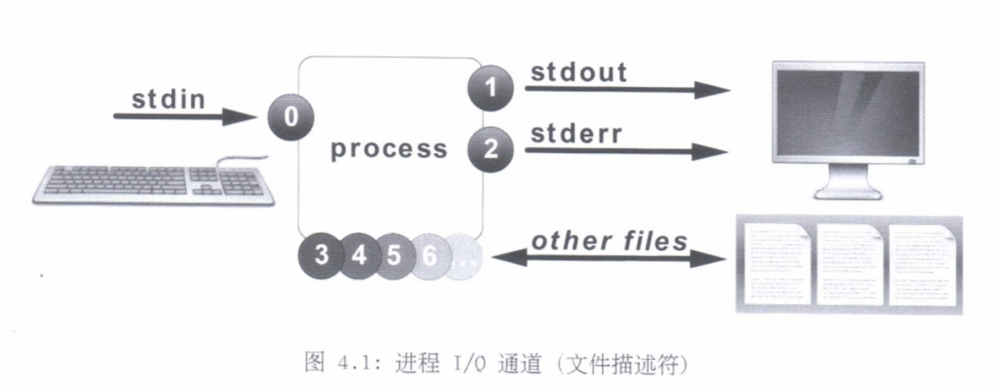
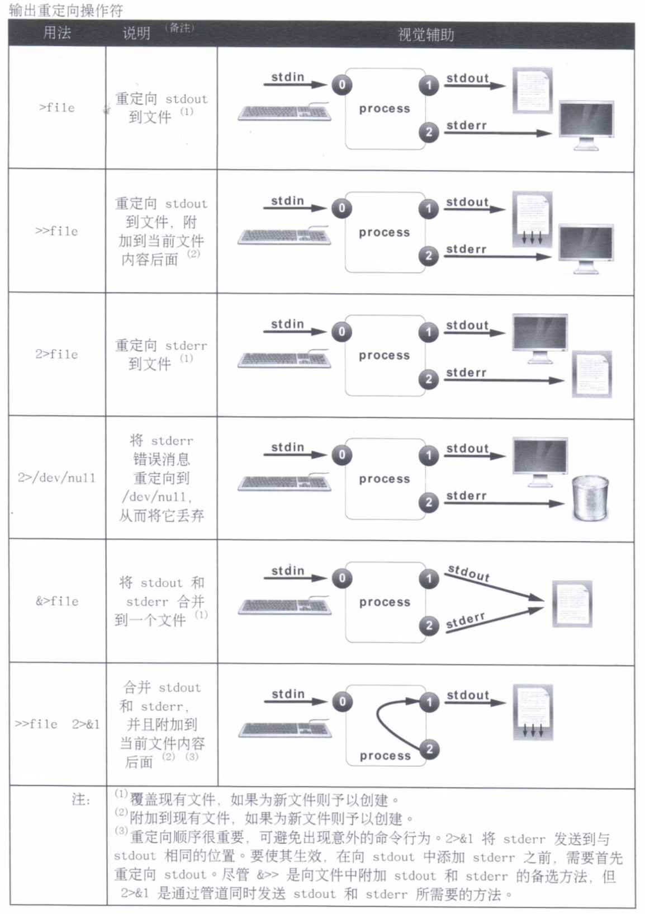
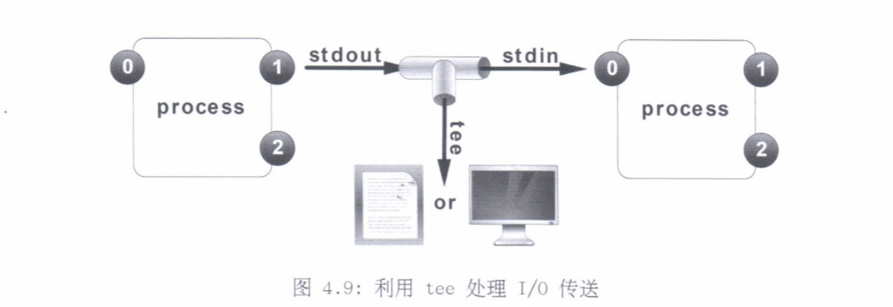
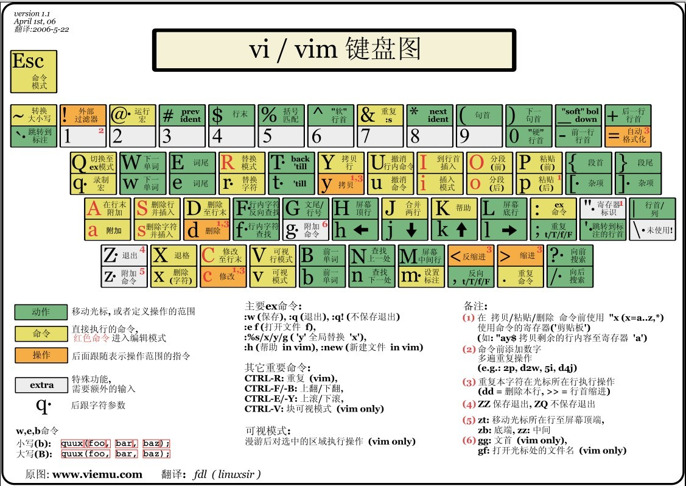

# 4.创建、查看和编辑文本文件

---

## 将输出重定向到文件或程序

* 标准输入、标准输出和标准错误
* 重定向输出到文件
* 构建管道

### 标准输入、标准输出和标准错误

构建了一个带有用标记的**通道（文件描述符）**的进程结果来管理打开的文件。

进程连接到文件，从而到达这些文件所代表的数据内容或设备。

#### 通道（文件描述符）

<table>
	<tr>
		<th width=15%>编号</th>
		<th width=20%>通道名称</th>
		<th width=25%>描述</th>
		<th width=20%>默认连接</th>
		<th width=20%>用法</th>
	</tr>
	<tr>
		<td>0</td>
		<td>stdin</td>
		<td>标准输入</td>
		<td>键盘</td>
		<td>仅读取</td>
	</tr>
	<tr>
		<td>1</td>
		<td>stdout</td>
		<td>标准输出</td>
		<td>终端</td>
		<td>仅写入</td>
	</tr>
	<tr>
		<td>2</td>
		<td>stderr</td>
		<td>标准错误</td>
		<td>终端</td>
		<td>仅写入</td>
	</tr>
	<tr>
		<td>3+</td>
		<td>filename</td>
		<td>其他文件</td>
		<td>无</td>
		<td>读取和/或写入</td>
	</tr>
</table>

### 重定向输出到文件

通道重定向将默认通道目标位置替换为代表输出文件或设备的文件名。

特殊文件`/dev/null`以静默方式**丢弃**重定向到其中的通道输出。

### 构建管道

重定向控制的是至/自文件的通道输出，而**传送则将通道输出发送到另一进程**。

`tee`命令显示或重定向通常因传送而被隐藏的**中间结果**。

## 从 Shell 提示符编辑文本文件

* 使用`Vim`编辑文件

### 使用`Vim`编辑文件

`Linux`的一个重要设计原则是信息存储在基于文本的文件中。

第一次打开时，`Vim`以命令模式启动，可用于导航、剪切和粘贴，以及其他文本操作。

* 访问特定的编辑功能：
	* 按 `i` 键 进入**插入模式**
	* 按 `v` 键 进入**可视模式**
	* 按 `:` 键 进入**命令模式**

## 使用图形编辑器编辑文本文件

* 通过`gedit`编辑文件
* 在图形窗口之间复制文本

### 通过`gedit`编辑文件

`gedit`应用是面向`GNOME`桌面环境的全功能文本编辑器。

### 在图形窗口之间复制文本

