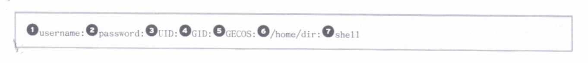
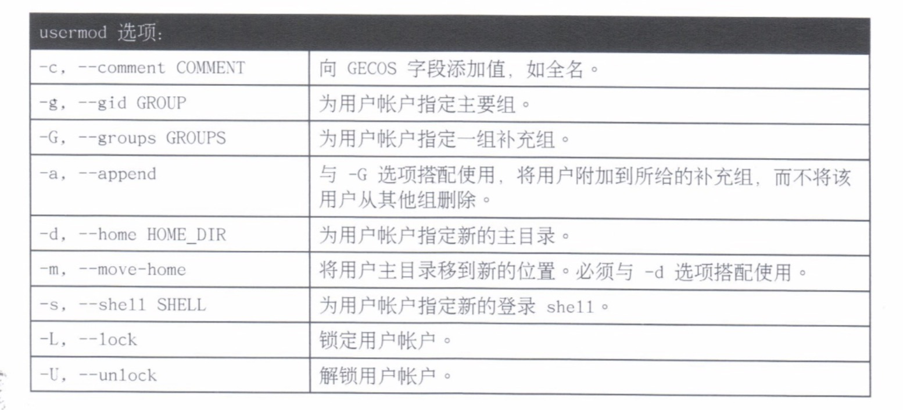
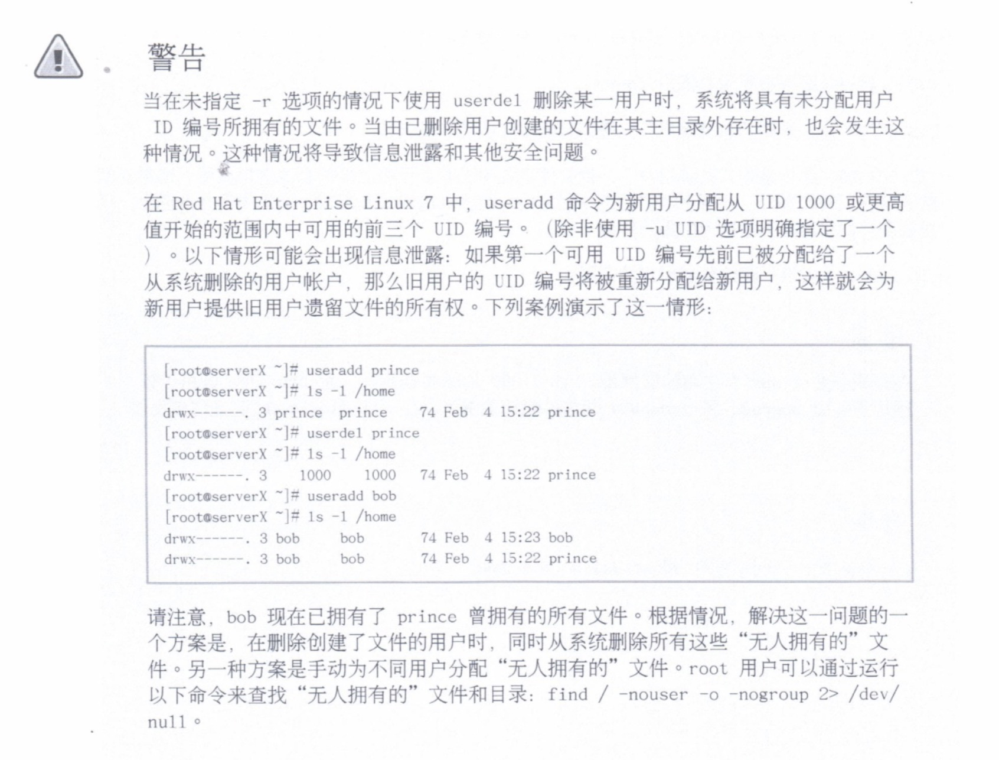
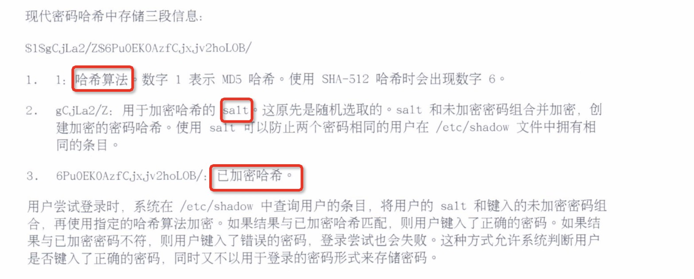
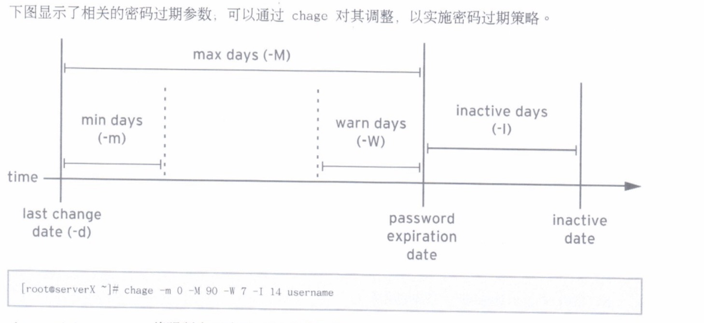

# 5.管理本地Linux用户和组

---

## 用户和组

* 什么是用户？
* 什么是组？

### 什么是用户？

系统中每个进程（运行程序）都作为一个特定用户运行。每个文件归一个特定用户所有。对文件和目录的访问受到用户的限制。与运行程序相关联的用户可确定该进程可访问的文件和目录。

`id`命令用于显示有关**当前已登录用户的信息**。

* `ls -l`命令：第三列显示某一文件或目录相关联的用户
* `ps`命令：查看进程信息
	* `a`选项：查看与某一终端相关的所有进程
	* `u`选项：查看与进程相关联的用户，第一列显示用户名

操作系统内部按照`UID`编号来跟踪用户。名称到编号的映射在账户信息数据库中定义。系统使用简单“平面文件”（即`/etc/passwd`文件）存储有关本地用户的信息。`/etc/passwd`采用以下格式（**七个冒号**分隔字段）：



1. `username` 是 `UID` 到名称的一种映射，便于用户使用。
2. `password` 以前是以加密格式保存密码的位置。现在，密码存储在称为 `/etc/shadow` 的单独文件中。
3. `UID` 是用户`ID`，即在最基本的级别标识用户的编号。
4. `GID` 是用户的主要组 `ID` 编号。
5. `GECOS` 字段是任意文本，通常包含用户的实际姓名。
6. `/home/dir` 是用户的个人数据和配置文件的位置。
7. `shell` 是用户登录时运行的程序。对于普通用户，这通常是提供用户命令行提示符的程序。

### 什么是组？

与用户一样，组也有名称和编号（`GID`）。本地组在 `/etc/group` 中定义。

#### 主要组

* 每个用户有且只有一个主要组
* 对于本地用户，主要组通过 `/etc/passwd` 第三字段中列出的组的 `GID` 编号定义
* 通常，用户创建的新文件归主要组所有
* 通常，新建用户的主要组是名称与用户相同的新建组。用户是此用户专业组（`UPG`）的唯一成员

#### 补充组

* 用户可以是零个或多个补充组的成员
* 属于被地租补充成员的用户列在 `/etc/group` 中组条目的最后一个字段中。对于本地组，用户成员身份由 `/etc/group` 中组条目的最后一个字段中由逗号分隔的用户列表确定。


* 补充组成员身份用于帮组确保用户具有对系统中文件及其他资源的访问权限。

## 获取超级用户访问权限

* `root`用户
* 利用`su`切换用户
* 通过`sudo`以`root`身份运行命令

### `root`用户

**超级用户，即具有系统全部权限的用户**。

默认情况下，只有 `root` 用户可以管理“固定”硬盘。

因为 `root` 用户拥有可破坏系统的无限制权限，建议管理员以正常用户身份登录，仅在需要时升级到 `root` 用户特权。

### 利用`su`切换用户

`su` 命令可让用户切换至另一个用户账户。如果未指定用户名，则意味着使用 `root` 账户。

* 普通用户调用时，系统将提示输入要切换到的账户的密码
* `root` 用户调用时，则无需输入账户密码。

```
su [-] <username>
```

> 命令 `su username` 和 `su - username` 的区别

* 命令 `su username` 会启动 **non-login shell**，命令 `su - username` 则启动 **login shell**
* `su -` 会将 **shell** 环境设置为如同该用户身份完全登录一样，`su` 仅以该用户身份使用当前的环境设置启动 **shell**

大多数情况下，管理员希望运行 `su -` 以或得用户的常规设置

### 通过`sudo`以`root`身份运行命令

`sudo` 命令可以使用户根据`/etc/sudoers`文件中的设置，而被允许以`root`或其他用户身份运行命令行。

* `sudo`命令要求用户输入其自己的密码以进行验证，可让管理员将细微的权限交给用户来委派系统管理任务，而无需交出 `root` 密码。
* 通过`sudo`执行的所有命令都默认为将日志记录到`/var/log/secure`中

## 管理本地用户账户

* 管理本地用户
* `UID` 范围

### 管理本地用户

#### `useradd` 创建用户

* 不带选项运行时，`useradd username` 会为 `/etc/passwd` 中的所有字段**设置合理的默认值**，默认情况下，`useradd` 命令不设置任何有效的密码，用户也**必须要等设定了密码后才能登录**。
* `useradd --help` 显示用于覆盖默认值的基本选项。大多数情况下，可以将系统的选项用于 `usermod` 命令，已修改现有的用户。

#### `usermod` 修改现有的用户

* `usermod --help` 将显示可用于修改账户的基本选项，常见选项包括：



#### `userdel` 删除用户

* `userdel username` 可将用户从 `/etc/passwd` 中删除，但默认情况下保留主目录不变。
* `userdel -r username` 同时删除用户和其主目录。



#### `id` 显示用户信息

* `id` 将显示用户信息，包括用户的 `UID`编号和组成员资格。
* `idusername` 将显示 `username` 的用户信息，包括用户的 `UID` 编号和组成员资格。

#### `passwd` 设置密码

* `passwd username` 用于设置用户的初始密码或更改该用户的密码。
* `root` 用户可以将密码设置为任何值。
* 普通用户必须选择长度至少为8个字符，且不以字典词语、用户名或上一密码为基础的密码。

### `UID` 范围

特定的`UID`编号和编号范围用于特殊的目的

* `UID 0` 始终分配至残疾用户账户 `root`
* `UID 1-200` 是一系列“**系统用户**”，静态分配给红帽的系统进程
* `UID 201-999` 是一系列“**系统用户**”，供文件系统中没有自己的文件的系统进程使用。通常在安装需要它们的软件时，从可用池中动态分配它们。
* `UID 1000+` 是可供分配给普通用户的范围

## 管理本地组账户

* 管理补充组

### 管理补充组

#### `groupadd` 创建组

* `groupadd groupname` 如果不带选项，则使用 `/etc/login.defs` 文件中指定范围内的下一个可用`GID`
* `-g GID` 选项用于指定具体的`GID`
* `-r` 选项将使用 `/etc/login.defs` 文件中所列有系统 `GID` 编号范围内的 `GID` 创建系统组

#### `groupmod` 修改现有的组

* `groupmod` 命令用于将组名更改为`GID`映射。`-n`选项用于指定新的名称
* `-g` 选项用于指定新的 `GID`

#### `groupdel` 删除组

* `groupdel` 命令将删除组
* **如果组是任何现有用户的主要组，则它不能被删除**。与 `userdel` 一样，请检查所有文件系统，确保不遗留由该组拥有的任何文件。

#### `usermod` 变更组成员资格

* 组成员资格通过用户管理进行控制。通过 `usermod -g groupname` 更改用户的主要组。
* 通过 `usermod -aG groupname username` 将用户添加到补充组。`-a` 选项可使 `usermod` 函数进入“**附加**”模式，如果不使用此选项，用户将从所有其他补充组中删除

## 管理用户密码

* 阴影密码和密码策略
* 密码过期
* 限制访问

### 阴影密码和密码策略

以前，加密的密码存储在全局可读的 `/etc/passwd` 文件中，直到对加密密码的字典式攻击变得常见。后来，加密密码或“密码哈希”移到更加安全的 `/etc/shadow` 文件中，**新文件允许实施密码期限和到期功能**。



#### `/etc/shadow` 格式

`/etc/shadow`采用以下格式（**九个冒号**分隔字段）：


1. 登录名称。这必须是系统中的有效账户名。
2. 已加密的密码。密码字段的开头为感叹号时，表示该密码已被锁定。
3. 最近一次更改密码的日期，以距离1970年1月1日的天数表示。
4. 可以更改密码前的最少天数，如果为0则表示“无最短期限要求”。
5. 必须更改密码前的最多天数。
6. 密码即将到期的警告期。以天数表示，0表示“不提供警告”。
7. 账户在密码到期后保持活动的天数。在此期限内，用户依然可以登录系统并更改密码。在指定天数过后，账户被锁定，变为不活动。
8. 账户到期日期，以距离1970年1月1日的天数表示。
9. 预留字段

### 密码过期



* `chage -d 0 username` 将强制在下次登录时更新密码。
* `chage -l username` 将列出用户名的当前设置。
* `chage -E YYYY-MM-DD` 将在指定的日期使账户到期。

**`date` 命令可用于计算未来的日期**

### 限制访问

* 通过 `chage` 命令，可以设置账户到期。到期后，用户无法以交互方式登录系统。
* `usermod` 命令可以通过 `-L` 选项“锁定”账户。
* `usermod -U username` 命令“解锁”账户。
* `nologin shell` 可以防止以交互方式使用系统，但不会阻止所有访问。
