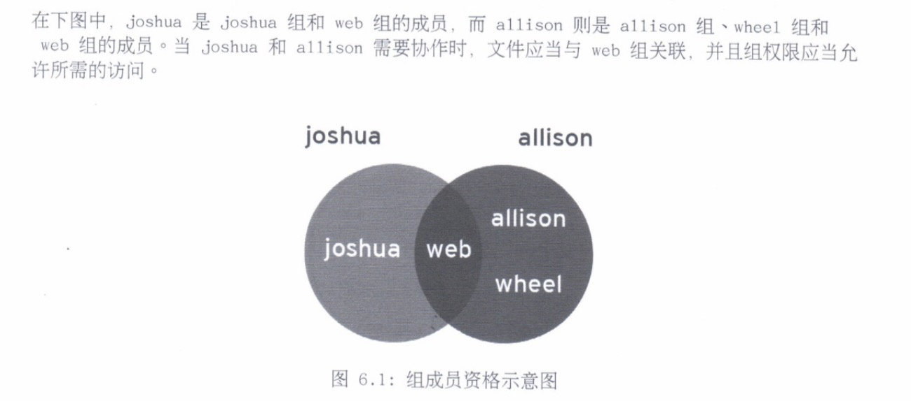
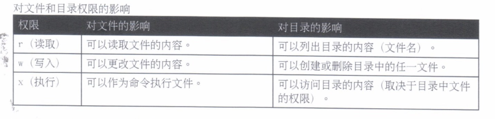
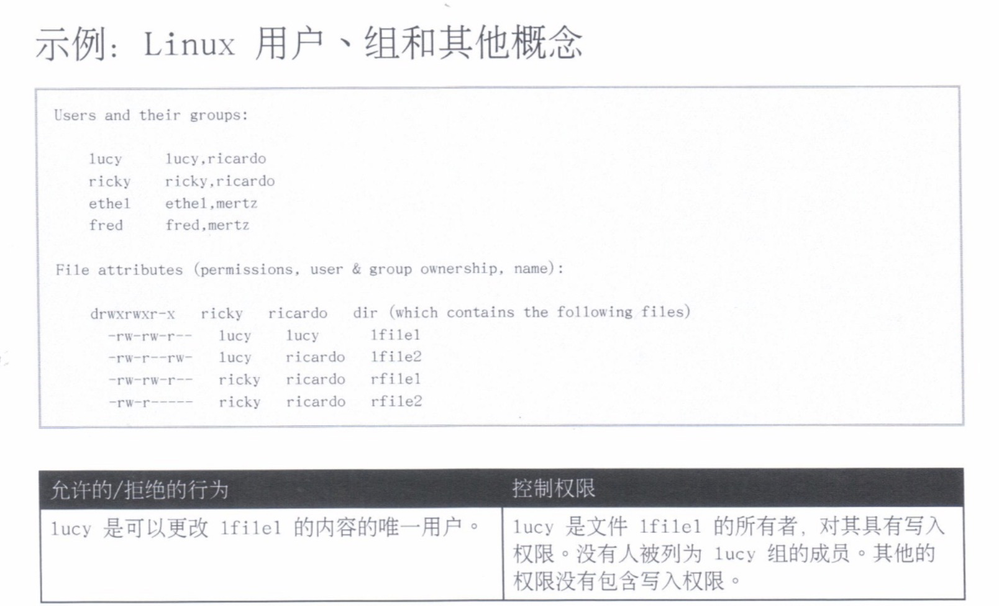
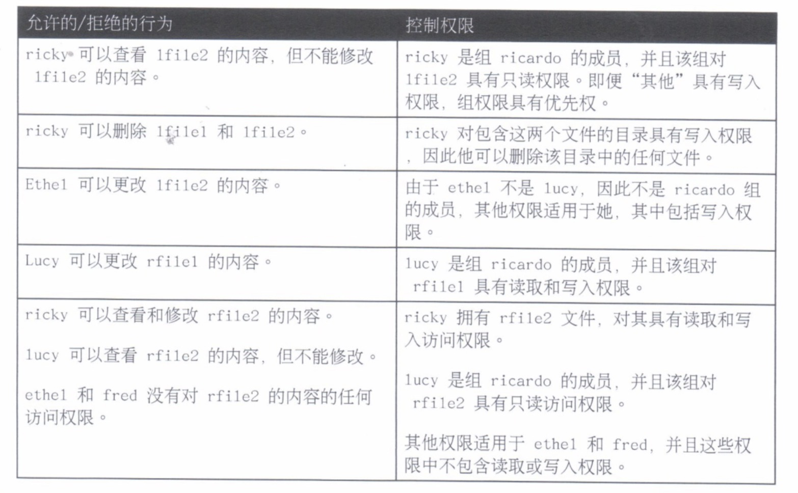
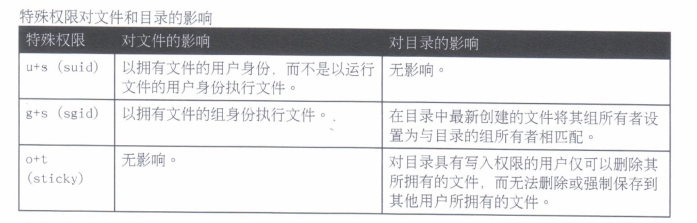
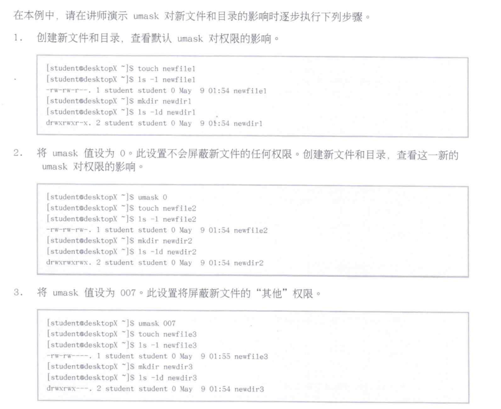
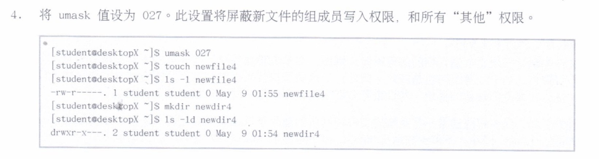
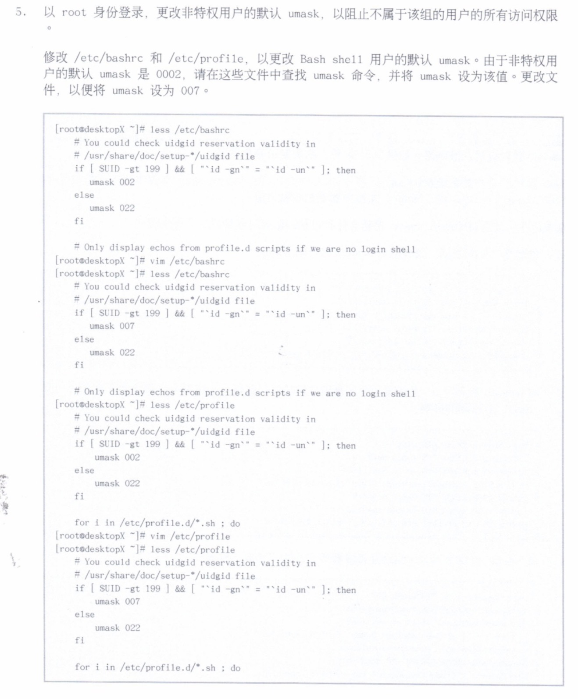
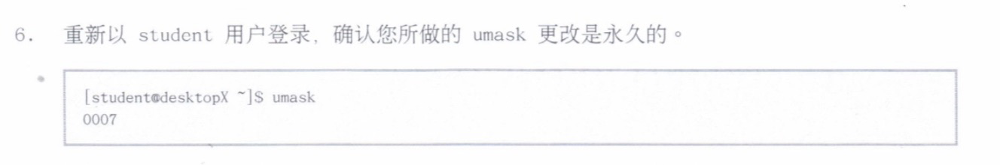

# 6.利用Linux文件系统权限控制文件访问

---

## Linux 文件系统权限

* Linux 文件系统权限
* 查看文件/目录权限和所有权

### Linux 文件系统权限

**用户权限覆盖组权限，从而覆盖其他权限**。



只有三种权限可应用：**读取、写入和执行**。这些权限对文件和目录的影响如下：



* 用户通常对只读目录具有 `read` 和 `exec` 权限，因此他们可以列出目录并访问其内容。
* 如果用户仅对某目录具有 `read` 访问权限，**可以列出其中文件的名称**，但是其他信息（包括权限或时间戳）都不可以，也不可访问。
* 如果用户仅对某目录具有 `exec` 访问权限，他们**不能列出该目录中文件的名称**，但如果他们已知道对其具有读取权限的文件的名称，那么他们可以通过明确指定文件名来访问该文件的内容。

### 查看文件/目录权限和所有权

`ls` 命令的 `-l` 选项将展开文件列表，以包括文件的权限和所有权，如 `ls -l test`。

`ls -l directoryname` 命令将显示驻留在该目录中所有文件的扩展列表。如要阻止下降至该目录，但可看到目录本身的扩展列表，可在 `ls` 命令上添加 `-d` 选项，如 `ls -ld /home`。




## 从命令行管理文件系统权限

* 更改文件/目录的权限
* 更改文件/目录的用户或组所有权

### 更改文件/目录的权限

用于从命令行更改权限的命令为 `chmod`，是“**change mode（更改模式）**”的简称（**权限也称为文件的模式**）。`chmod` 命令在要更改的文件或目录列表后面列出了权限说明。可使用**符号**（符号法）或**数值**（数值法）来发布此权限说明。

#### 符号法

```
chmod WhoWhatWhich file|directory
```

* `Who` 是指 **u、g、o、a（代表用户、组、其他、全部）**
* `What` 是指 **+、-、=（代表添加、删除、精确设置）**
* `Which` 是指 **r、w、x（代表读取、写入、可执行）**

#### 数值法

```
chmod ### file|directory
```

* 每个数字代表一个访问级别：用户、组、其他
* `#` 是 **r=4、w=2 和 x=1 的和**

**注意：**对于在整个目录树中递归地设置权限，`chmod` 命令支持 `-R` 选项。当使用此选项时，务必要使用 `X` 权限，而不是 `x` 权限，表示应仅对目录而不是普通文件设置执行权限。如 `chmod -R g+rmX demodir`

### 更改文件/目录的用户或组所有权

* `chown` 命令可更改文件所有权。如，要将文件 foofile 的所有权授予给 student，可使用命令：`chown student foofile`
* `chown` 命令可与 `-R` 选项配合使用，以递归更改整个目录树的所有权
* `chown` 命令可用于更改文件的组所有权，只需在组名称之前加上冒号（:）。如，将 foodir 组更改为 admins，可使用命令：`chown :admins foodir`
* `chown` 命令可用于同时更改所有者和组，此时可使用语法 `owner:group`。如，要将 foodir 的所有权更改为 visitor，同时将组更改为 guests，可使用命令：`chown visitor:guests foodir`

**注意：**除了使用 `chown` 外，部分用户通过 `chgrp` 命令更改组所有权；此命令的工作方式与通过 `chown` 命令更改所有权完全相同，也可使用 `-R` 选项来作用与整个目录树。

## 管理默认权限和文件访问

* 特殊权限
* 默认文件权限

### 特殊权限

对可执行文件的 `setuid`（或 `setgid`）权限表示将以文件的用户（或组）身份运行命令，而不是以运行命令的用户身份。

目录的粘滞位可以为文件杀出设置特殊限制：仅文件所有者（和 `root` 用户）可以删除目录中的文件。

对某目录的 setgid 权限表示在该目录中创建的文件将继承该目录的组所属关系，而不是继承自创建用户。这通常用于组协作目录，将文件从默认的专有组自动更改为共享组。



#### 设置特殊权限

* 用**符号**表示：
	* `setuid=u+s`
	* `setgid=g+s`
	* `sticky=o+t`
* 用户**数值**表示（**第四位**）：
	* `setuid=4`
	* `setgid=2`
	* `sticky=1`

### 默认文件权限

文件的默认权限由创建它们的进程设置。`mkdir` 命令创建新的目录，并设置有全部的权限，即读取、写入和执行。

这些权限通常不是在新的文件和目录创建时予以设置。这是因为其中一些权限被 `shell` 进程的 `umask` 清除。`umask` 命令显示 `shell` 的 `umask` 的当前值。

系统的每个进程都具有 `umask`，它是一个八进制位掩码，用于**清除有该进程创建的新文件和目录的权限**。

通过一个数字参数使用 `umask` 命令，可以更改当前 `shell` 的 `umask`。如果少于 3 位，则假定带有前导零。

`Bash shell` 用户的系统默认 `umask` 在 `/etc/profile` 和 `/etc/bashrc` 文件中定义。用户可以在他们的 `.bash_profile` 和 `.bashrc` 文件中覆盖系统默认值。




