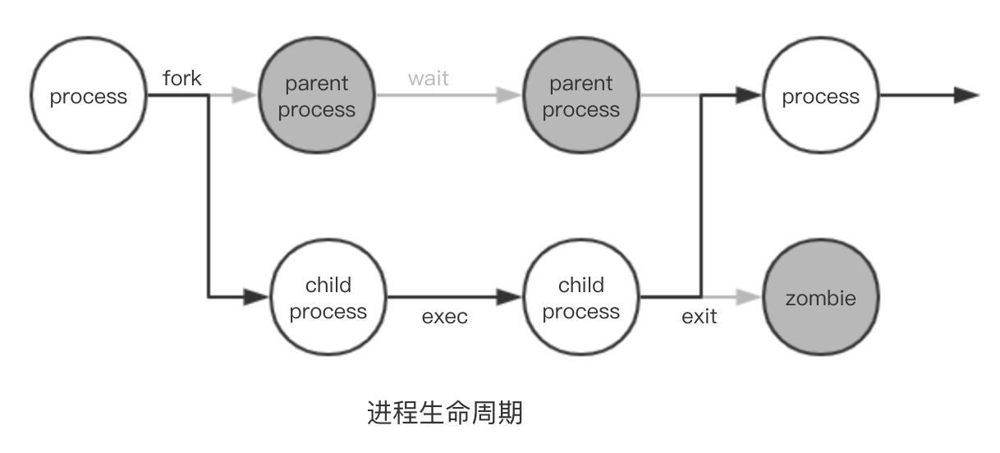
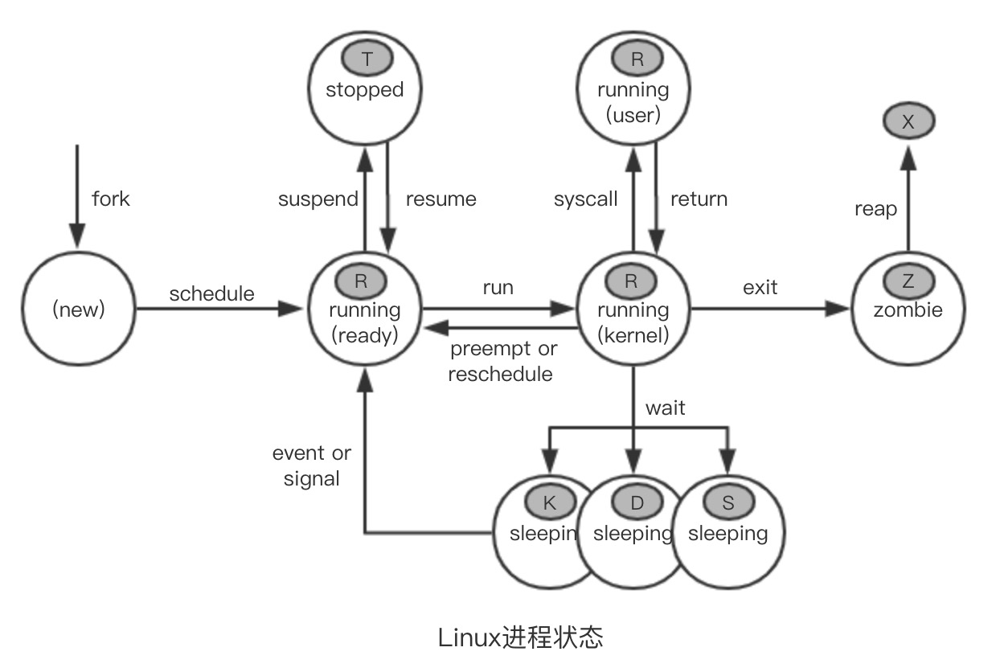
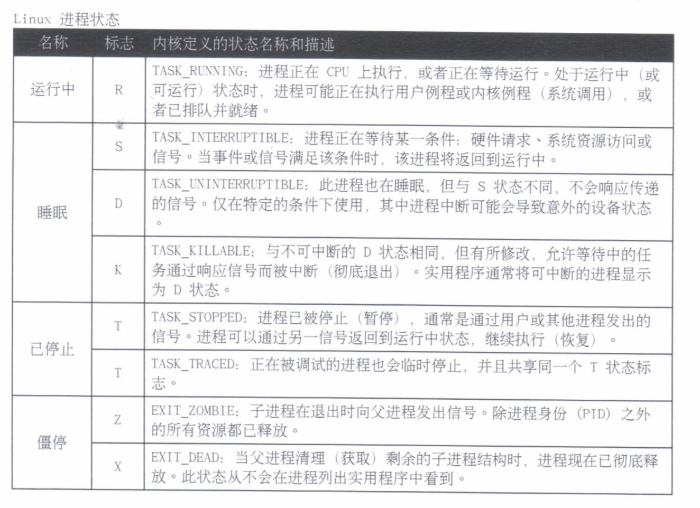
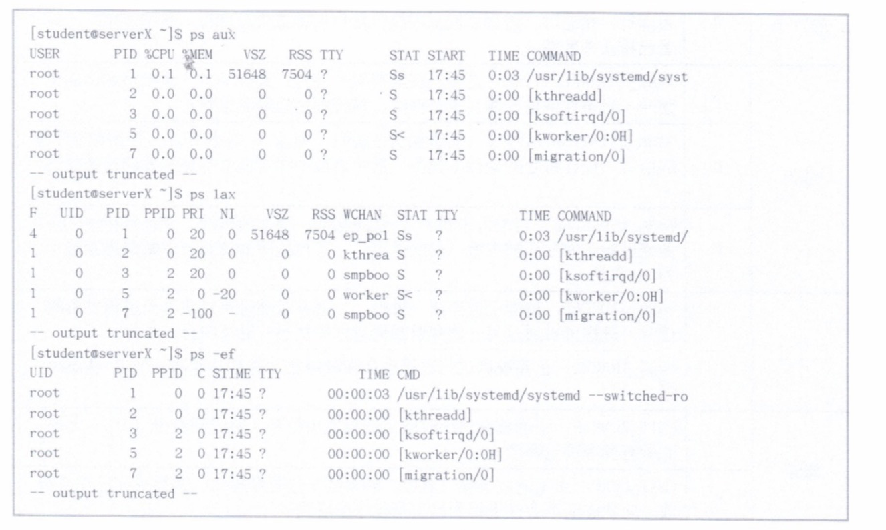
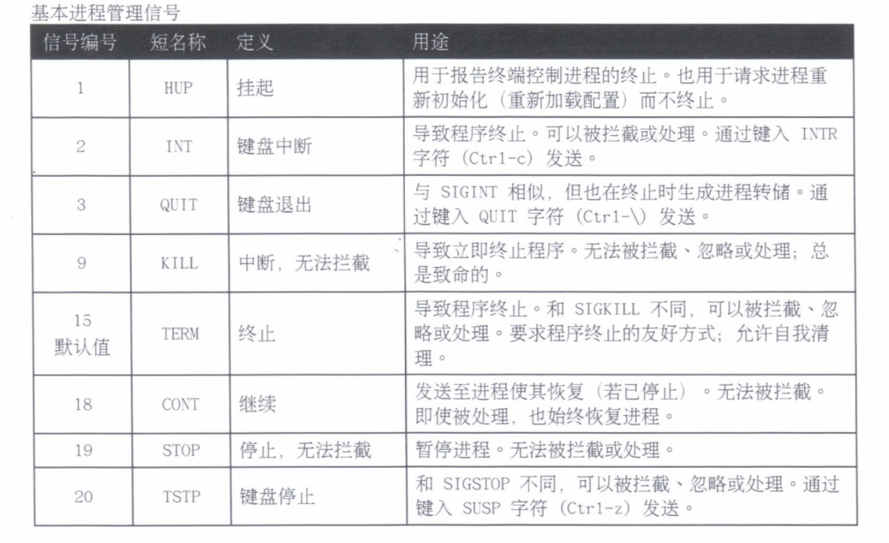
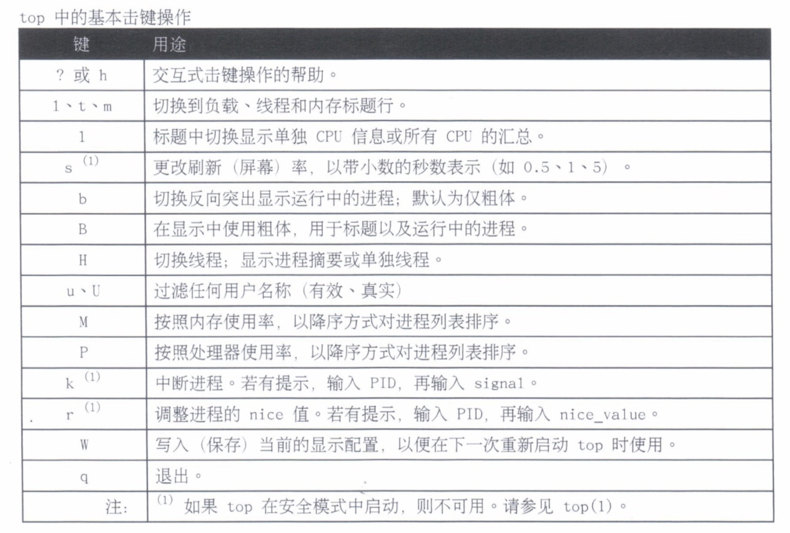

# 7.监控和管理Linux进行

---

## 进程

* 什么是进程？
* 进程状态
* 列出进程

### 什么是进程？

进程是**已启动的可执行程序的运行中实例**。

进程**组成部分**：

* 已分配内存的地址空间；
* 安全属性，包括所有权凭据和特权；
* 程序代码的一个或多个执行线程；
* 进程状态

**进程的环境**包括：

* 本地和全局变量；
* 当前调度上下文；
* 分配的系统资源，如文件描述符和网络端口

现有的（父）进程复制自己的地址空间（fork）来创建一个新的（子）进程结构。每个新进程分配有一个唯一进程`ID（PID）`，满足跟踪和安全性之需。任何进程可创建子进程。所有进程都是第一个系统进程的后代，**第一个系统进程是 systemd(1)**。

### 进程状态

在多任务处理操作系统中，**每个CPU（或CPU核心）在一个时间点上处理一个进程**。在进程运行时，它对CPU时间和资源分配的直接要求会有变化。进程分配有一个**状态，它随着环境要求而改变**。

### 列出进程

`ps` 命令用于列出当前的进程。该命令可以提供详细的进程信息，包括：

* 用户识别符（`UID`），它确定进程的特权；
* 唯一进程识别符（`PID`）；
* CPU 和已经花费的实时时间；
* 进程在各种位置上分配的内存数量；
* 进程的位置 `STDOUT`，称为控制终端；
* 当前的进程状态

**注意：**`ps -aux` 不同于 `ps aux`

选项：

* `ps aux`显示所有进程，包含用户感兴趣的列，以及没有控制终端的进程。
* `ps lax`提供更多技术详细信息，可通过避免查询用户名来加快显示。
* 相似的 UNIX 语法使用选项 `-ef` 来显示所有进程

默认情况下，不使用选项而运行 `ps`，将选择具有与当前用户相同的有效用户ID（`EUID`）并与调用 `ps` 所处同一终端关联的所有进程。

* 方括号中的进程（通常位于顶部）为调度的内核线程
* 僵停在 `ps` 列表中显示为 `exiting` 或 `defunct`
* `ps` 仅显示一次。如需重复更新的进程显示，请运行 `top(1)`
* `ps` 可以采用树形格式显示，来查看父/子关系
* 默认的输出没有排序。显示顺序有系统进程表的顺序匹配，在进程终止和新进程创建时重新试验列表行。输出可能会按照时间顺序显示，但不一定，除非使用明确的 `-O` 或 `--sort` 选项。

## 控制作业

* 作业和会话
* 在后台运行作业

### 作业和会话

作业控制是一种命令 `shell` 功能，允许单个 `shell` 实例运行和管理多个命令。使用作业控制时，可以选择性地暂停、恢复和异步运行命令，让 `shell` 可以在子进程运行期间返回接受其他命令。

**前台进程**是在终端窗口中运行的命令。终端的设备ID（`tty`）是进程的控制终端。前台进程接收键盘生成的输入和信号，可以从终端读取或写入到终端（如通过 `stdin` 和 `stdout`）。

**后台进程**是以无控制终端的形式启动的，因为它不需要终端交互。在 `ps`列表中，此类进程（如服务守护进程和内核进程线程）将在 `TTY` 列中显示一个问号（?）。后台进程如果（不当）尝试从终端读取或写入到终端，可能会被暂停。

### 在后台运行作业

任何命令都可以在后台启动，只需在命令行中附加 `&` 符号（&）。`bash shell`显示作业编号（对于该会话唯一）和新的子进程的`PID`。命令 `shell` 不等待子进程，并且重新显示 `shell` 提示符。

**注意：**`&`符号仅将管道中的最后一个命令置于后台，除非命令集括号括起。返回的 `PID` 来自管道的最后一个进程。管道中的所有进程现在是统一作业的成员。

`bash` 命令 `shell` 根据会话跟踪作业，这些作业可通过 `jobs` 命令显示在一张表中。

通过 `fg` 命令和作业 `ID（%job number`）将后台作业带到前台，后台作业可以重新和控制终端连接。如 `fg %1`

`ps` 选项 `j` 显示作业信息，如各个会话的初始命令 `shell`。即 `ps j`

要在后台重新启动进程，可使用 `bg` 命令及相同的作业ID。如 `bg %1`

## 中断进程

* 使用信号控制进程
* 以管理员身份注销用户

### 使用信号控制进程

信号是传递至进程的软件中断。信号向执行中的程序报告事件。生成信号的事件可以是错误或外部事件（如I/O请求或计时器过期），或者来自于明确请求（如使用信号发送命令或键盘序列）。

每个信号都有一个默认操作，通常是如下之一：

* 终止：导致程序立即终止（退出）
* 河西转储：导致程序保存内存映像（核心转储），然后终止
* 停止：导致程序停止执行（暂停），再等待继续（恢复）

程序可以通过实施句柄例程来为预期的事件信号做准备，以忽略、替换或扩展信号的默认操作。

通过明确请求发送信号的命令：

* 暂停：（Ctrl-z）
* 中断：（Ctrl-c）
* 核心转储：（Ctrl-\）

可以通过名称或编号指定信号。用户可以中断自己的进程，但需要 `root` 特权才能终止由其他人拥有的进程。

* `kill` 命令根据 `ID` 向进程发送信号。该命令可用于发送任何信号，不仅仅是终止程序的信号。
* `killall` 可发送信号到一个或多个与选择条件匹配的进程，如命令名称、由特定用户拥有的进程，或系统范围内的所有进程。
* `pkill` 命令和 `killall` 相似，也可向多个进程发送信号。`pkill` 使用高级选择条件，可包含以下条件的组合：
	* 命令：具有模式匹配的命令名称的进程
	* `UID`：由某一 `Linux` 用户账户拥有的进程，无论是有效的还是真实的。
	* `GID`：由某一 `Linux` 组账户拥有的进程，无论是有效的还是真实的。
	* 父级：特定父进程的子进程。
	* 终端：运行于特定控制终端的进程。

### 以管理员身份注销用户

`w` 命令可查看当前登录系统的用户，以及他们积累的活动。通过 `TTY` 和 `FROM` 列确定用户的位置。

所有用户都有一个控制终端，在图形环境窗口（虚拟终端）中操作时其列为 `pts/N`,而通过系统控制台、替代控制台或其他直接连接的终端设备操作时则列为 	`ttyN`。使用 `-f` 选项时，远程用户在 `FROM` 列中显示器系统名称。

**注意：**虽然 `SIGTERM` 是默认的信号，但 `SIGKILL` 是管理员偏爱但常常误用的信号。 `SIGKILL`信号无法被处理或忽略，它总是致命的。它会强行终止进程，而不允许被终端的进程允许自我清理例程。建议先发送 `SIGTERM`，只有在进程未能响应时再通过 `SIGKILL` 重试。

## 监控进程活动

* 负载平均值
* 实时进程监控

### 负载平均值

`Linux` 内核以负载数（**活动系统资源请求的`CPU`累计数**）的指数移动平均值计算负载平均值指标。

* 活动请求数从运行中线程和等待 `I/O` 的线程的每个`CPU`队列数计算，因为内核跟踪进程资源活动，对应的进程状态也会有变化。
* **负载数是默认每五秒运行一次的计算例程，它累计所有`CPU`的活动请求数并计算出一个平均值**。
* 指数移动平均值是一个数学公式，**可以平滑趋势数据的高值和低值，提高当前活动重要度，并降低老化数据质量**。
* **负载平均值是负载数计算例程的结果**。整体而言，它指的是最近1分钟、5分钟和15分钟内**系统活动数据的三个显示值的平均值**。

#### 了解 Linux 负载平均值计算

#### 解读显示的负载平均值

* `top`、`uptime`、`w`和`gnome-system-monitor`显示负载平均值
* 将显示的负载平均值除以系统中逻辑`CPU`数。值低于1表示资源利用率较好，等待时间很短。值高于1表示资源饱和，而且有一定的服务等待时间。

### 实时进程监控

`top` 程序是系统进程的动态视图，显示一个摘要标题，以及与 `ps` 信息类似的进程或线程列表。`top`以可配置的间隔持续刷新，而且也一个列重新排列、排序和突出显示功能。用户配置可以保存，变为永久。

默认输出列可以从其他资源工具识别：

* 进程ID（`PID`）
* 用户名称（`USER`）是进程所有者
* 虚拟内存（`VIRT`）是进程正在使用的所有内存，包括常驻集合、共享库，以及任何映射或交换的内存页。（`ps` 命令中标为 `VSZ`）
* 常驻内存（`RES`）是进程所用的物理内存，包括任何驻留的共享对象。（`ps` 命令中标为 `RSS`）
* 进程状态（`S`）显示为：
	* `D`：不可中断睡眠
	* `R`：运行中或可运行
	* `S`：睡眠中
	* `T`：已停止或已跟踪
	* `Z`：僵停
* `CPU` 时间（`TIME`）是进程启动以来总的处理时间。可以切换为包含所有过去子进程的累计时间
* 进程命令名称（`COMMAND`）

