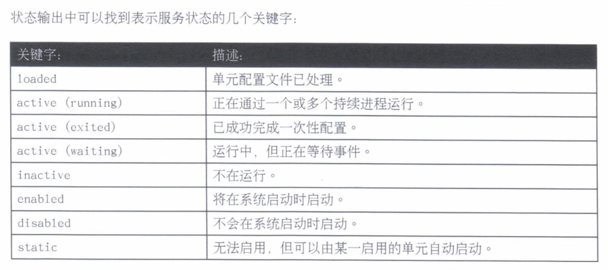
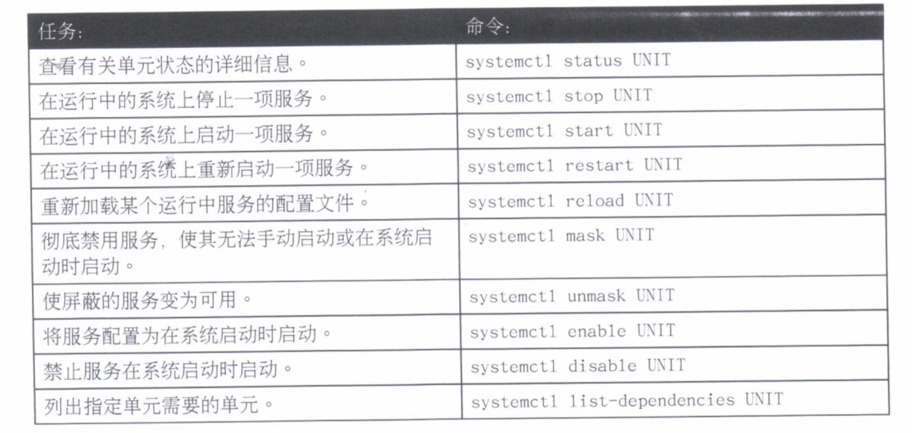

# 8.控制服务和守护进程

---

## 识别自动启动的系统进程

* `systemd` 简介
* 使用 `systemct1` 列出单元文件

### `systemd` 简介

系统启动和服务器进程由 `systemd` 系统和服务管理器进行管理。此程序提供了一种方式，可以在启动时和运行中的系统上激活系统资源、服务器守护进程和其他进程。

**守护进程**是在执行各种任务的后台等待或运行的进程。一般情况下，守护进程在系统启动时自动启动并持续运行至关机或被手动停止。按照惯例，需要守护进程的名称以字母 `d` 结束。

为了**侦听连接，守护进程使用套接字**。这是与本地或远程客户端的主要通信通道。套接字可能有守护进程创建，或者可能从守护进程隔开并通过另一进程创建，如`systemd`。**当客户端建立连接时，套接字传递到守护进程**。

**服务通常指的是一个或多个守护进程**，但启动或停止一项服务可能会对系统的状态进行一次性更改，不会留下守护进程之后继续运行（称为 `oneshot`）。

在RHEL7中，进程`ID`1属于 `systemd` 这一新的init系统。以下是 `systemd` 提供的几项新功能：

* 并行化功能，它可提高系统的启动速度
* 按需启动守护进程，不需要单独的服务
* 自动服务依赖关系管理，可以防止长时间超市，例如在网络不可用时不启动网络服务
* 利用 `Linux` 控制组一起追踪相关进程的方式

#### `systemct1` 和 `systemd` 单元

`systemct1` 命令用于管理各种类型的 `systemd` 对象，它们称为单元。可以通过 `systemct1 -t help` 命令显示可用单元类型的列表。

**重要：**`systemct1` 可以缩写或"省略"单元名称、进程树条目和单元说明，除非运行时带有 `-l` 选项。

#### 常用单元类型

* **服务单元**具有 `.service` 扩展名，代表**系统服务**。这种单元用于启动经常访问的守护进程，如 web 服务器。
* **套接字单元**具有 `.socket` 扩展名，代表**进程间通信（IPC）套接字**。套接字的控制可以在建立客户端连接时传递到守护进程或新启动的服务。套接字单元用于延迟系统启动时的服务启动，或者按需启动不常使用的服务。这原则上类似于使用 `xineted` 超级服务器按需启动的服务。
* **路径单元**具有 `.path` 扩展名，用于将服务的激活推迟到特定文件系统更改发生之后。这通常用于实验假脱机目录的服务，如打印系统。

#### 服务状态

可以通过 `systemct1 status name.type` 查看服务的状态。如果未提供单元类型，则 `systemct1` 将显示服务单元的状态（如果存在）。



### 使用 `systemct1` 列出单元文件

**注意：** `systemct1` 命令将使用 `less`来自动对输出分页。 

* 1、查看所有单元的状态，以验证系统启动

```
systemct1
```

* 2、仅查询服务单元的状态

```
systemct1 --type=service
```

* 3、调查处于失败或维护状态的任何单元。可选择添加 `-l` 选项以显示完整的输出

```
systemct1 status rngd.service -l
```

* 4、可以使用 `status` 参数来判断特定的单元是否活动，以及显示该单元是否已启用在系统启动时启动。其他备用命令也可显示活动和已启用状态：

```
systemct1 is-active sshd

systemct1 is-enabled sshd
```

* 5、列出所有已加载单元的活动状态。可选择限制单元类型。`--all` 选项可加入不活动的单元。

```
systemct1 list-units --type=service

systemct1 list-units --type=service --all
```

* 6、查看所有单元的已启用和已禁用设置。也可选择限制单元类型。

```
systemct1 list-units-files --type=service
```

* 7、仅查看失败的服务。

```
systemct1 --failed --type= service
```

## 控制系统服务

* 启动和停止运行中系统上的系统守护进程
* 使系统守护进程在系统启动时启动或停止
* `systemct1` 命令摘要

### 启动和停止运行中系统上的系统守护进程

更改配置文件或对服务进行其他更新可能需要重新启动该服务。需要停止不再使用的服务后，才能删除相关软件。

* 1、查看服务的状态

```
# 查看状态
systemct1 status sshd.service
```

* 2、验证进程正在运行

```
ps -up PID
```

* 3、停止服务并验证其状态

```
systemct1 stop sshd.service

systemct1 status sshd.service
```

* 4、启动服务并查看其状态。进程 `ID` 已经改变

```
systemct1 start sshd.service

systemct1 status sshd.service
```

* 5、以单一命令停止服务，然后再启动该服务

```
systemct1 restart sshd.service

systemct1 status sshd.service
```

* 6、发出指示使服务读取和重新加载器配置文件，而不完全停止和启动服务。进程 `ID` 不会改变

```
systemct1 reload sshd.service

systemct1 status sshd.service
```

#### 单元依赖项

服务可能会以其他服务依赖项的形式启动。禁用服务将禁用其依赖项。

`systemct1 list-dependencies UNIT` 命令可以用户打印出启动指定单元时必须要启动的其他单元的树型列表。根据确切的依赖关系，其他单元可能需要在指定单元启动之前或之后运行。此命令的 `--reverse` 选项将显示哪些单元必须要在指定单元启动后才能运行。

#### 屏蔽服务

有时，系统中可能安装了互相冲突的服务。为防止管理员意外启动某一服务，可以屏蔽该服务。屏蔽将在配置目录中创建链接，使得启动该服务时什么也不会发生。

```
# 屏蔽
systemct1 mask sshd.service

# 取消屏蔽
systemct1 unmask sshd.service
```

**重要：**

* **禁用**的服务不会在系统启动时自动启动，也不会被其他单元文件启动，可以手动启动。
* **屏蔽**的服务无法手动启动，也不会自动启动。

### 使系统守护进程在系统启动时启动或停止

* 1、查看服务的状态

```
systemct1 status sshd.service
```

* 2、禁用服务并验证其状态。请注意**禁用服务不会停止该服务**

```
systemct1 disable sshd.service

systemct1 status sshd.service
```

* 3、启用服务并验证其状态

```
systemct1 enable sshd.service

systemct1 is-enabled sshd.service
```

### `systemct1` 命令摘要

可以在运行中的系统上启动和停止服务，也可启用或禁用服务在系统启动时自动启动。

