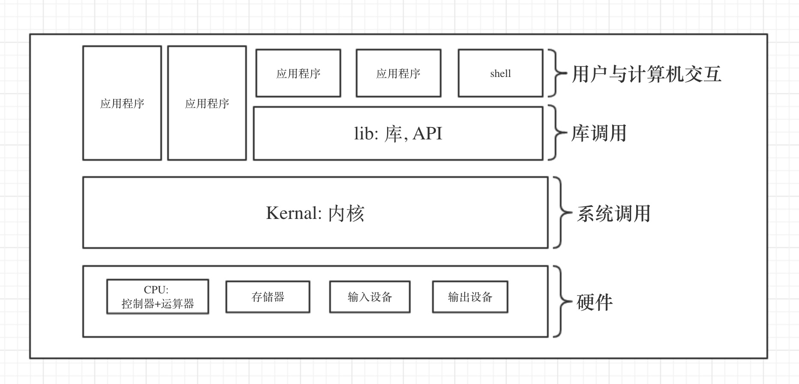

# 01_03\_操作系统基础

---

## 计算机系统

### 硬件

* CPU
	* 控制器: 整个计算机的中枢神经
	* 运算器: 对数据进行加工处理
* 存储器
	* 内存: 存储指令和数据, 与CPU进行沟通的桥梁, 计算机中所有程序的运行都是在内存中进行的
	* 硬盘
* 输入设备
* 输出设备

### 软件

* 内核: 操作系统的核心, 系统调用, 整个系统资源的监控
* 库: 库调用, 不能自我独立运行, 向其他程序提供服务的代码
* 应用程序: 单一可执行文件或单一程序
* shell: 用户与计算机交互
	* GUI: 图形界面
	* CLI: 命令行

## 内核

### 内核功能

* 进程管理
* 内存管理
* 文件系统
* 网络功能
* 硬件驱动
* 安全机制