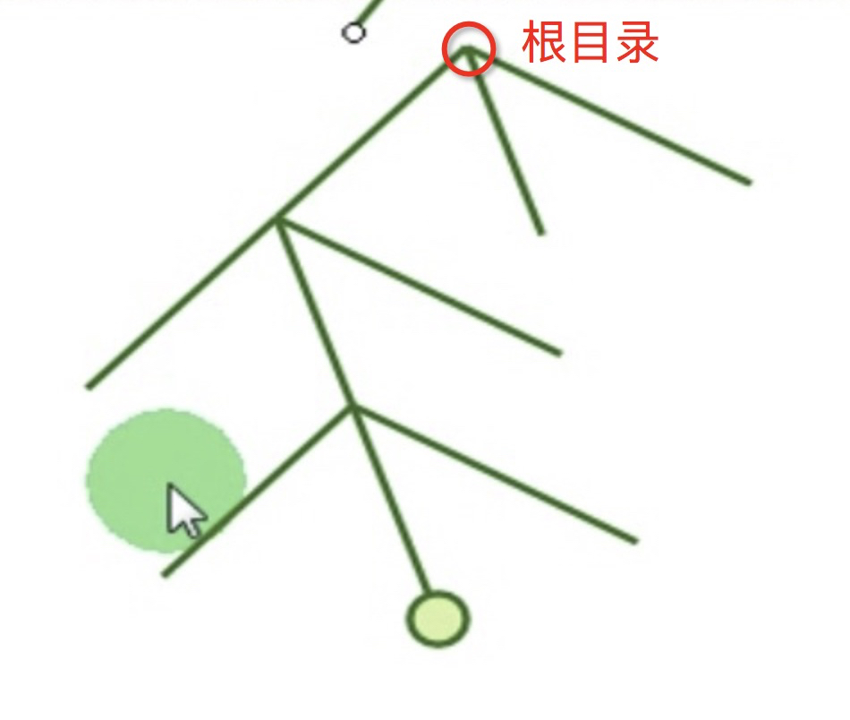

# 02_01\_Linux操作系统及常用命令

---

## 库(library)

=应用程序依赖

* Windows
	* .dll(Dynamic Link Library): 动态链接库
* Linux
	* .so(shared object): 动态链接库

## 使用凭证

可以登录的用户(用户名: 用户ID)

* 认证机制: Authorization
* 授权: Authorization
* 审计: Audition(日志)

## magic number(魔数)

标识作用的信息

**Shebang`#!`**: 脚本中第一行开头中写到, 它指明了执行这个脚本文件的解释程序

## bash

`#!/bin/bash` 指此脚本使用**/bin/bash**来解释执行, 只能放在第一行

## 文件

* 文件
	* 普通文件, 即file
	* 文件属性: **-**
* 目录
	* 目录文件, 路径映射文件 
	* 文件属性: **d**

### ls

```
root@aa748cd25683:/var/www/html# ls -l
drwxr-xr-x 19 root     root        608 Apr 15 18:19 Application
-rw-r--r--  1 root     root       4510 Mar 26 18:39 updateIdSXBZXJGX

root@aa748cd25683:/var/www/html# ls -lh
-rw-r--r--  1 root     root     4.5K Mar 26 18:39 updateIdSXBZXJGXX

root@aa748cd25683:/var/www/html# ls -a
.
..
.git

root@aa748cd25683:/var/www/html# ls -i
1416786 Application
3372450 updateIdSXBZXJGXX
```

* 选项
	* -l: 长格式
	* -h: 做单位转换, 单位为**K**, 如`4.5K`
	* -a: 显示隐藏文件, 如`.`, `..`, `.git`
	* -d: 显示目录自身属性	
	* -i: inode(index node), 如`1416786`, `3372450`
	* -r: 逆序显示
	* -R: 递归(recursive)显示

#### 选项 `-l`

##### 第一栏位 `drwxr-xr-x` 和 `-rw-r--r--`

* 文件类型
	* 第1个字母: 代表文件类型, 如`d`代表目录, `-`代表文件
* 文件权限: **rwx(读, 写, 执行)** 
	* 第2~4字母: 代表用户的权限, 如`rwx`, `rw-`
	* 第5~7字母: 代表用户组的权限, 如`r-x`, `r--`
	* 第8~10字母: 代表其他的用户的权限, 如`r-x`, `r--`

> 常见的文件类型

<table>
	<tr>
		<th width=25%>文件属性</th>
		<th width=75%>文件类型</th>
	</tr>
	<tr>
		<td>-</td>
		<td>普通文件(f)</td>
	</tr>
	<tr>
		<td>d</td>
		<td>目录文件(block)</td>
	</tr>
	<tr>
		<td>b</td>
		<td>块设备文件(block)</td>
	</tr>
	<tr>
		<td>c</td>
		<td>字符设备文件(character)</td>
	</tr>
	<tr>
		<td>l</td>
		<td>符号链接文件(symbolic link file)</td>
	</tr>
	<tr>
		<td>p</td>
		<td>命令管道文件(pipe)</td>
	</tr>
	<tr>
		<td>s</td>
		<td>套接字文件(socket)</td>
	</tr>
</table>

##### 第二栏位 `19` 和 `1`

* 文件硬链接的次数
	* 目录: 该目录中的文件个数, 如`19`
	* 文件: 那这个数目自然是1, 如`1`

##### 第三栏位 `root` 和 `root`

* 文件属主(owner): 用户名称

##### 第四栏位 `root` 和 `root`

* 文件属组(group): 用户组名称

##### 第五栏位 `608` 和 `4510`

* 文件大小(size): 单位是**字节**, 可用`-h`做单位转换 

##### 第六栏位 `Apr 15 18:19` 和 `Mar 26 18:39`

* 时间戳(timestamp): 最近一次被修改的时间
	* 访问时间(atime): access time
	* 修改时间(mtime): modify time, 文件内容发生改变
	* 状态修改时间(ctime): change time, 元数据(inode内容发生改变和block内容)发生改变

## 文件系统(File System)

文件系统层次化标准: FHS

### 文件路径

目录树: 起始点为**根目录**(`/, root`)



* 绝对路径: **是从根目录**(`/`)开始写起的文件名或目录名称, 如 `/home/`
* 相对路径: **不是从根目录**(`/`)开始写起的文件名或目录名称, 当前所在路径的**相对位置**
	* `.`: 表示**当前目录**, 也可以用`./`来表示
	* `..`: 表示**上一层目录**, 也可以用`../`来表示 

### pwd(Printing Working Directory)

当前工作目录的绝对路径名称

### cd(change directory)

家目录, 主目录, home directory

* cd ~USERNAME: 进入指定用户的家目录
* cd -: 在当前目录和前一次所在目录之间来回切换

## 命令类型

* 命令类型
	* 内部命令(shell内置)
	* 外部命令: 在文件系统的某个路径下有一个与命令名称相应的可执行文件

### type

显示指定命令的类型

## 环境变量`PATH`

用于定义当前用户的工作环境 

* 变量: 命名的内存空间
* 变量赋值: **=**, 如`NAME=Jerry`

```
root@aa748cd25683:/var/www/html# printenv
TERM=xterm
PWD=/var/www/html
PATH=/usr/local/sbin:/usr/local/bin:/usr/sbin:/usr/bin:/sbin:/bin

root@aa748cd25683:/var/www/html# echo $PATH
/usr/local/sbin:/usr/local/bin:/usr/sbin:/usr/bin:/sbin:/bin
```
	
PATH: 使用**冒号`:`**分隔的路径

### hash

键值对, 键值数据库, 在数据库查找内容速度为[O(1)](#复杂度)

hash表, 会记录下执行该命令的次数, 以及命令的绝对路径, 相当于**缓存**, **第一次执行命令时, shell默认会从PATH路径下寻找该命令的路径, 当你第二次使用该命令时, shell会先查看hash表, hash表中没有该命令才会去PATH路径下寻找**

	root@aa748cd25683:/var/www/html# hash
	hits	command
	   1	/usr/bin/printenv
	   2	/bin/ls

* hits: 执行该命令的次数
* command: 该命令的绝对路径

## <a name="复杂度">复杂度</a>

<table>
	<tr>
		<th width=15%>大O阶</th>
		<th width=15%>术语</th>
		<th width=70%>描述</th>
	</tr>
	<tr>
		<td>O(1)</td>
		<td>常数介</td>
		<td>这是最好的。无论有多少数据，算法总是花费相同的时间。如：通过索引查找数组的元素。</td>
	</tr>
	<tr>
		<td>O(logn)</td>
		<td>对数介</td>
		<td>很棒。这些算法在每次迭代时将数据量减半。如果您有100个项目，则需要大约7个步骤才能找到答案。有1,000个项目，需要10个步骤。1,000,000件商品只需20步。即使对于大量数据，这也非常快。如：二进制搜索。</td>
	</tr>
	<tr>
		<td>O(n)</td>
		<td>线性介</td>
		<td>很好的表现。如果你有100件商品，那就可以完成100件工作。将项目数量加倍会使算法花费两倍的时间（200个工作单元）。如：顺序搜索。</td>
	</tr>
	<tr>
		<td>O(nlogn)</td>
		<td>nlogn介</td>
		<td>体面的表现。这比线性稍差但不太糟糕。如：最快的通用排序算法</td>
	</tr>
	<tr>
		<td>O(n^2)</td>
		<td>平方介</td>
		<td>有点慢。如果你有100个项目，那么100 ^ 2 = 10,000个单位的工作。将项目数量加倍会使其慢四倍。如：使用嵌套循环的算法，插入排序。</td>
	</tr>
	<tr>
		<td>O(n^3</td>
		<td>立方介</td>
		<td>表现不佳。将输入大小加倍会使其慢八倍。如：矩阵乘法。</td>
	</tr>
	<tr>
		<td>O(2^n)</td>
		<td>指数介</td>
		<td>表现很差。你应该避免使用这些算法，但有时你别无选择。仅向输入添加一位会使运行时间加倍。如：旅行售货员问题。</td>
	</tr>
	<tr>
		<td>O(n!)</td>
		<td>阶乘介</td>
		<td>无比缓慢。它真的需要一百万年才能完成任何事情。</td>
	</tr>
</table>
