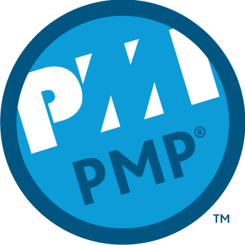
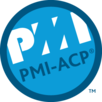

# 学习笔记

---

## 考试

### 2018年

*  

### 2019年

*  

## 视频

### 在看视频

#### 2019年

* 马哥Linux
	* 运维初级教程
		* 第一节 
			* [01_03\_操作系统基础](./Linux/马哥视频/01_03_操作系统基础.md) Done
			* [01_04\_Linux操作系统基础](./Linux/马哥视频/01_04_Linux操作系统基础.md) Done
		* 第二节 
			* [02_01\_Linux操作系统及常用命令](./Linux/马哥视频/02_01_Linux操作系统及常用命令.md) Done
			* [02_02\_Linux操作系统及常用命令](./Linux/马哥视频/02_02_Linux操作系统及常用命令.md) Done
			* 02_03\_Linux根文件系统详解
			* 02_04\_Linux文件管理命令详解
		* 第三节 
			* ... 

### 未看视频

* 马哥Linux
	* 运维中级教程

## 书单

### 已读书单

#### 2016年

* 编写可读性代码的艺术
* Head First PHP&MySQL(中文版)
* Modern PHP

#### 2017年

* 图解HTTP

#### 2018年

* 用户故事与敏捷方法
* 用户故事地图
* PMP

#### 2019年

* ACP
* 从小工到专家
* 代码整洁之道

### 在读书单

* 代码大全
* Head First JAVA
* Head First 设计模式
* HTTP权威指南
* 图解TCP/IP
* 图解设计模式
* 明解C语音(入门篇)
* 网络是怎样连接的
* 程序是怎样跑起来的
* Head First PHP&MySQL(英文版)
* 重构
* 高效能人士的七个习惯

#### 2019年

* 实现模式
	* 第一章 Done 
	* 第二章 Done 
	* 第三章 Done 
	* 第四章 Done 
	* 第五章 Done
	* 第六章 Done
	* 第七章
	* 第八章
	* 第九章
	* 第十章
* 鸟哥的LINUX私房菜(基础学习篇)
	* 第一部分
		* 第零章 略读 
		* 第一章 略读 
		* 第二章 略读
		* 第三章 略读
		* 第四章 Done
	* 第二部分 
		* 第五章 Done
		* 第六章 Done
		* 第七章 Done
		* 第八章 Done
	* 第三部分
		* 第九章 Done
		* 第十章 Done  
		* 第十一章  
		* 第十二章 
	* 第四部分
		* 第十三章 
		* 第十四章 
		* 第十五章 
		* 第十六章 
	* 第五部分
		* 第十七章 
		* 第十八章 
		* 第十九章 
		* 第二十章 
		* 第二十一章 
		* 第二十二章 
		* 第二十三章 
		* 第二十四章 

### 未读书单

* Go语言实战
* 明解C语言(中级篇)
* Linux命令行与shell脚本编程大全
* 计算机是怎样跑起来的
* 图解性能优化
* 重来
* 四步创业法
* 一万小时天才理论
* 餐巾纸的背面
* 架构整洁之道
* 构建高性能Web站点
* 代码未来
* 松本行弘的程序世界
* 代码之髓
