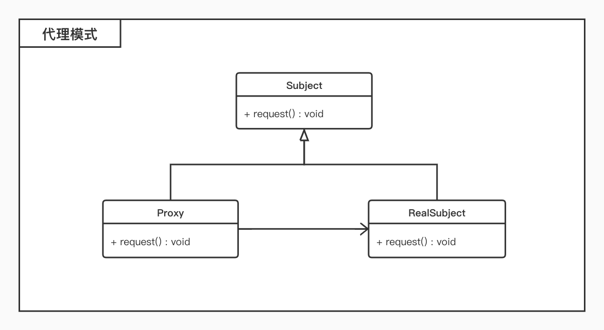

# 代理模式

## 概述

* 为其他对象提供一种代理以控制对这个对象的访问；
* 在某些情况下，一个对象不适合或者不能直接引用另一个对象，代理对象可以在对象之间起到**中介**的作用；

## 结构

* 代理模式包含如下角色：
	* `Subject`：抽象主题角色
		* 通过接口或抽象类声明真实角色实现的业务方法； 
	* `Proxy`：代理主题角色
		* 实现抽象角色，是真实角色的代理，也叫做委托类或代理类，通过真实角色的业务逻辑方法来实现抽象方法； 
	* `RealSubject`：真实主题角色 
		* 实现抽象角色，也叫做被委托角色或被代理角色，是业务逻辑的具体执行者，供代理角色调用；

