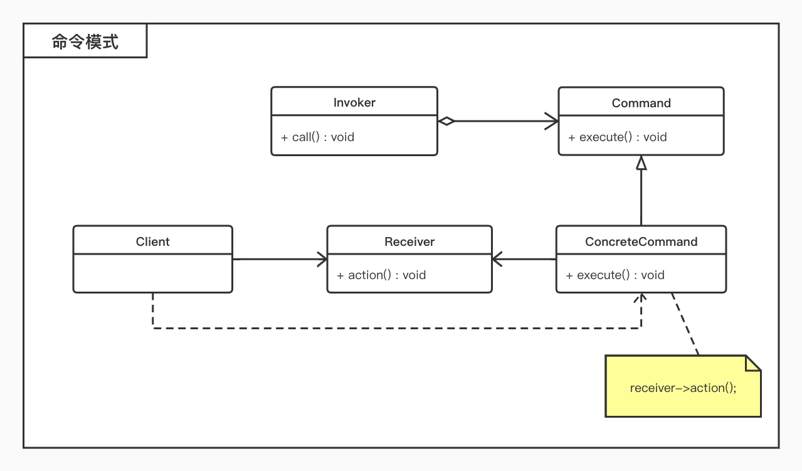

# 命令模式

## 概述

* 将一个请求封装为一个对象，从而使我们可用不同的请求对客户进行参数化；
* 每一个命令都是一个操作：请求的一方发出请求，要求执行一个操作；接收的一方收到请求，并执行操作；
* 对命令进行封装，将发出命令的责任和执行命令的责任分割开；

## 结构

* 命令模式包含如下角色：
	* `Command`：抽象命令类 
	* `ConcreteCommand`：具体命令类
	* `Invoker`：调用者
	* `Receiver`：接收者
	* `Client`：客户类

## 适用环境

* 将请求调用者和请求接收者解耦，使得调用者和接收者不直接交互；
* 在不同的时间指定请求、将请求排队和执行请求；
* 支持命令的撤销(`Undo`)操作和恢复(`Redo`)操作；