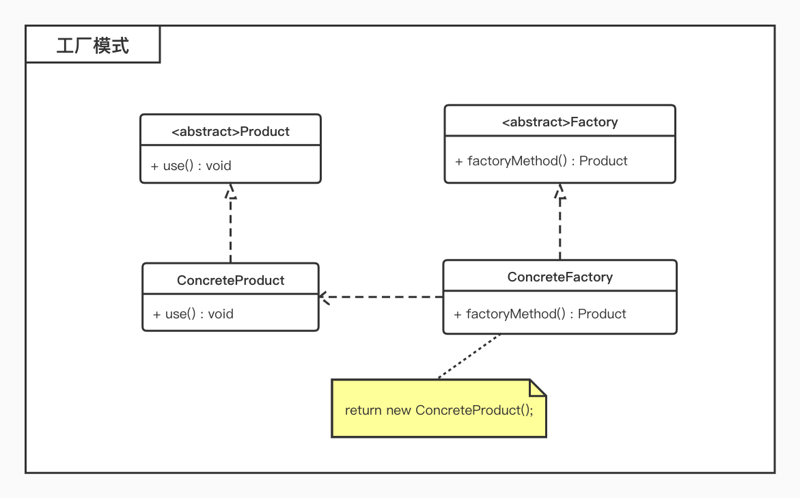

# 工厂模式

## 概述

* 工厂父类负责定义创建产品对象的公共接口，而工厂子类则负责生成具体的产品对象，这样做的目的是将产品类的实例化操作延迟到工厂子类中完成，即通过工厂子类来确定究竟应该实例化哪一个具体产品类；
* 在系统中加入新产品时，无须修改抽象工厂和抽象产品提供的接口，无须修改客户端，也无须修改其他的具体工厂和具体产品，而只要添加一个具体工厂和具体产品就可以了，更加符合**开闭原则**；

## 结构

* 工厂方法模式包含如下角色：
	* `Product`：抽象产品
	* `ConcreteProduct`：具体产品
	* `Factory`：抽象工厂
	* `ConcreteFactory`：具体工厂



## 适用环境

* 一个类不知道它所需要的对象的类；
* 一个类通过其子类来指定创建哪个对象；
* 将创建对象的任务委托给多个工厂子类中的某一个，客户端在使用时可以无须关心是哪一个工厂子类创建产品子类，需要时再动态指定；

## 示例

```php
<?php


interface IPeople
{
    public function say();
}

class Man implements IPeople
{
    public function say()
    {
        echo 'this is a man'.PHP_EOL;
    }
}

class Women implements IPeople
{
    public function say()
    {
        echo 'this is a women'.PHP_EOL;
    }
}

interface ICreatePeople
{
    public function create() : IPeople;
}

class ManFactory implements ICreatePeople
{
    public function create() : IPeople
    {
        return new Man();
    }

}

class WomenFactory implements ICreatePeople
{
    public function create() : IPeople
    {
        return new Women();
    }
}


$manFactory = new ManFactory();
$man = $manFactory->create();
$man->say();

$womenFactory = new WomenFactory();
$women = $womenFactory->create();
$women->say();
```


