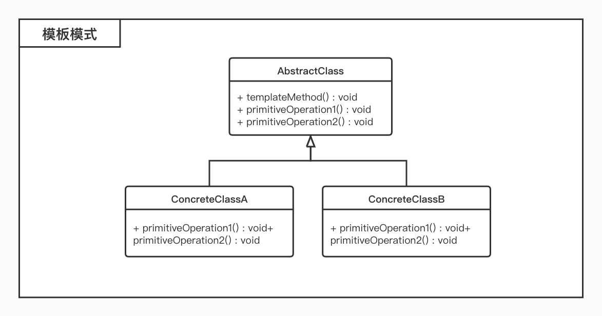

# 模板模式

## 概述

* 定义一个操作中算法的骨架，而将一些步骤延迟到子类中，模板方法使得子类可以不改变算法的结构即可重定义该算法的某些特定步骤；
* 完成一件事情，有固定的数个步骤，但是每个步骤根据对象的不同，而实现细节不同；在父类中定义一个完成该事情的总方法，按照完成事件需要的步骤去调用其每个步骤的实现方法；每个步骤的具体实现，由子类完成；
* 通过一个父类调用其子类的操作，通过子类对父类进行扩展增加新的行为，符合**开闭原则**；
* 属于**行为型模式**

## 结构

* 模板模式包含如下角色：
	* `AbstractClass`：抽象父类
		* 实现了模板方法，定义了算法的骨架； 
	* `ConcreteClass`：具体类
		* 实现抽象类中的抽象方法，不同的对象的具体实现细节； 

## 适用环境

* 重要，复杂的方法，例如框架的骨架；
* 有多个子类共有方法，且逻辑相同；
