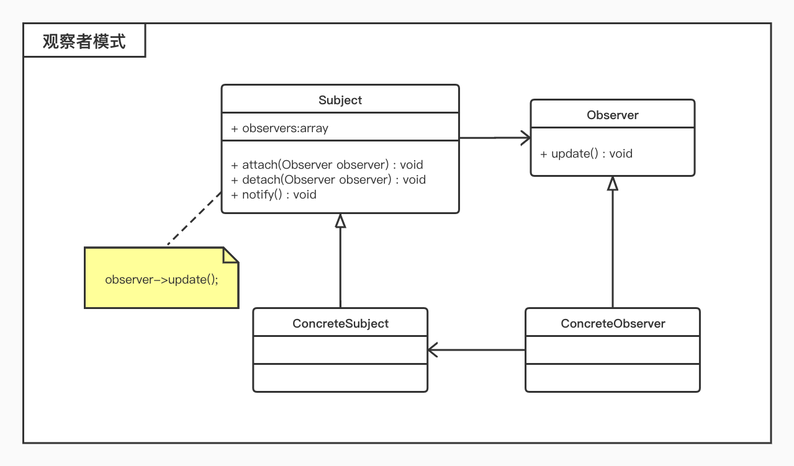

# 观察者模式

## 概述

* 定义对象间的一种一对多依赖关系，使得每当一个对象状态发生改变时，其相关依赖对象皆得到通知并被自动更新；
* 在观察者模式中，主题是通知的发布者，而被通知的对象称为观察者，一个主题可以对应多个观察者，而且这些观察者之间没有相互联系，可以根据需要增加和删除观察者，使得系统更易于扩展；

## 结构

* 观察者模式包含如下角色：
	* `Subject`：主题
		* 把所有观察者对象的引用保存到一个聚集里，每个主题都可以有多个的观察者，可以增加和删除观察者对象；
	* `ConcreteSubject`：具体主题
		* 将有关状态存入具体观察者对象；在具体主题内部状态改变时，给所有登记过的观察者发出通知；
	* `Observer`：观察者
		* 为所有的具体观察者定义一个接口，在得到主题通知时更新自己； 
	* `ConcreteObserver`：具体观察者
		* 实现抽象观察者角色所要求的更新接口；

## 适用环境

* 一个抽象模型有两个方面，其中一个方面依赖于另一个方面；
* 一个对象的改变将导致其他一个或多个对象也发生改变，而不知道具体有多少对象将发生改变；
* 一个对象必须通知其他对象，而并不知道这些对象是谁；