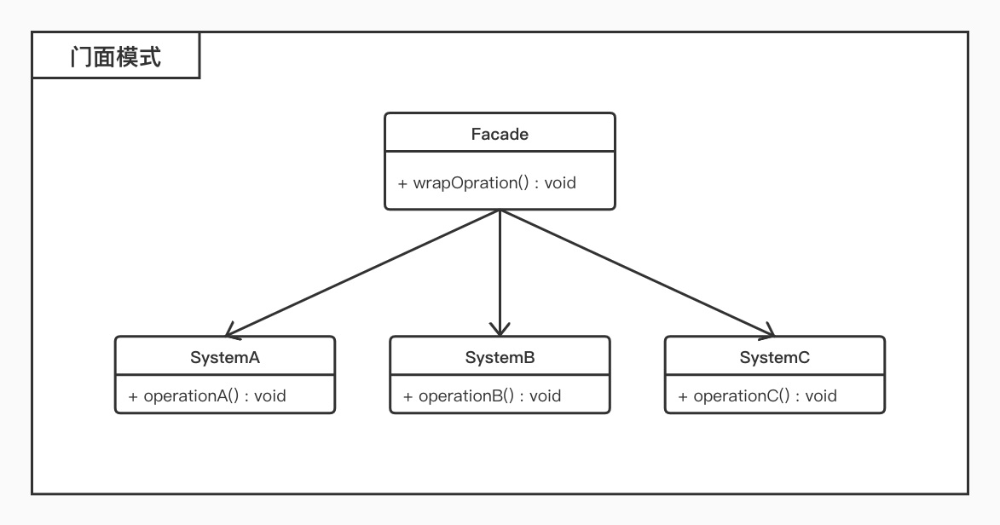

# 门面模式

## 概述

* 门面模式又称为**外观模式**；
* 提供一个统一的接口，用来访问子系统中的一群接口；
* 外观模式定义了一个高层接口，让子系统更容易使用；

## 结构

* 门面模式包含如下角色：
	* `Facade`：外观角色
	* `SubSystem`：子系统角色

## 适用环境

* 要为一个复杂子系统提供一个简单接口；
* 客户程序与多个子系统之间存在很大的依赖性；
* 在层次化结构中，需要定义系统中每一层的入口，使得层与层之间不直接产生联系；