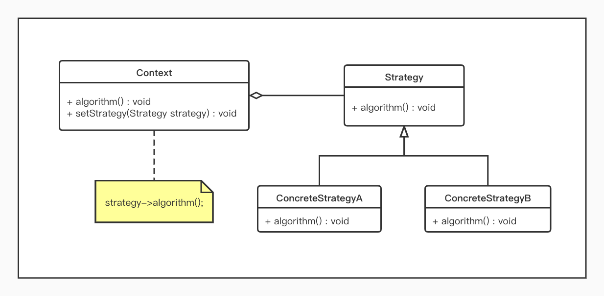

# 策略模式

## 概述

* 完成一项任务，可以有多种不同的方式，每一种方式称为一个策略，我们可以根据选择不同的策略来完成该项任务；
* 通过定义一系列算法，将每一个算法封装起来，并让它们可以相互替换；
* 策略模式让算法独立于使用它的客户而变化。

## 结构

* 策略模式包含如下角色：
	* `Context`: 环境类
	* `Strategy`: 抽象策略类
	* `ConcreteStrategy`: 具体策略类



## 示例

在出行旅游时，游客可以选择乘坐飞机、火车、汽车等多种不同的出行方式

```php
<?php


/**
 * 抽象策略类(Strategy)
 * 出行方式
 */
interface ITravelStrategy
{
    public function travelAlgorithm();
}

/**
 * 具体策略类(ConcreteStrategy)
 * 乘坐飞机
 */
class AirPlanelStrategy implements ITravelStrategy
{
    public function travelAlgorithm()
    {
        echo "travelbyAirPlain".PHP_EOL;
    }
}
 
/**
 * 具体策略类(ConcreteStrategy)
 * 乘坐火车
 */
class TrainStrategy implements ITravelStrategy
{
    public function travelAlgorithm()
    {
        echo "travelbyTrain".PHP_EOL;
    }
}
 
/**
 * 具体策略类(ConcreteStrategy)
 * 乘坐汽车
 */
class CarStrategy implements ITravelStrategy
{
    public function travelAlgorithm()
    {
        echo "travelbyCar".PHP_EOL;
    }
}

/**
 * 环境类(Context)
 * 游客可选择使用何种出行方式
 */
class VisitorContext 
{	

    /**
     * @var ITravelStrategy $travelStrategy 出行方式
     */
    private $travelStrategy;

    public function __construct(ITravelStrategy $travelStrategy)
    {
    	$this->travelStrategy = $travelStrategy;
    }

    public function setTravelStrategy(ITravelStrategy $travelStrategy) :void
    {
        $this->travelStrategy = $travelStrategy;
    }

    public function getTravelStrategy() : ITravelStrategy
    {
        return $this->travelStrategy;
    }

    public function travel()
    {
        return $this->getTravelStrategy()->travelAlgorithm();
    }

}

//乘坐飞机出行
$visitor = new VisitorContext(new AirPlanelStrategy());
$visitor->travel();
 
//乘坐汽车出行
$visitor = new VisitorContext(new CarStrategy());
$visitor->travel();
```
